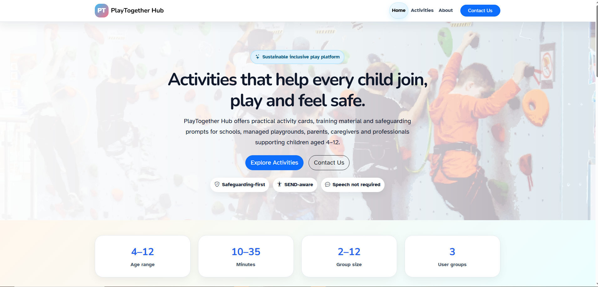
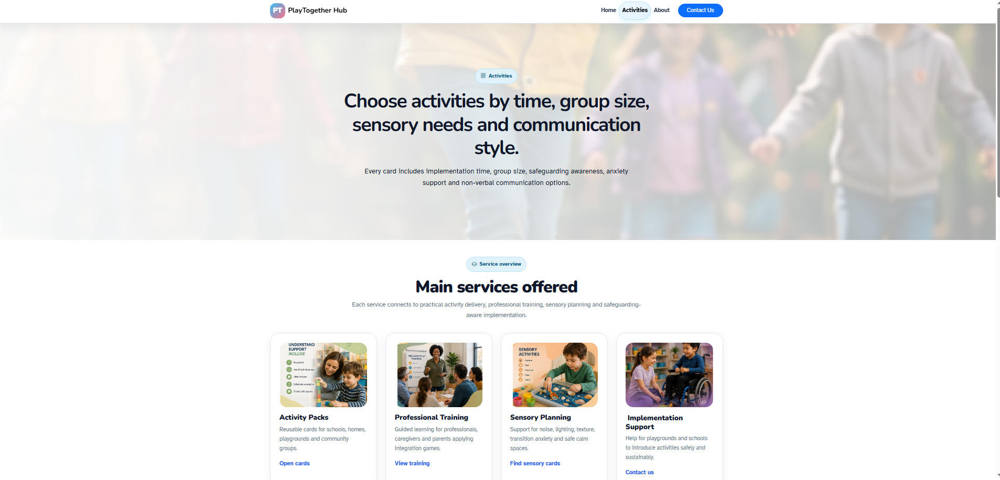
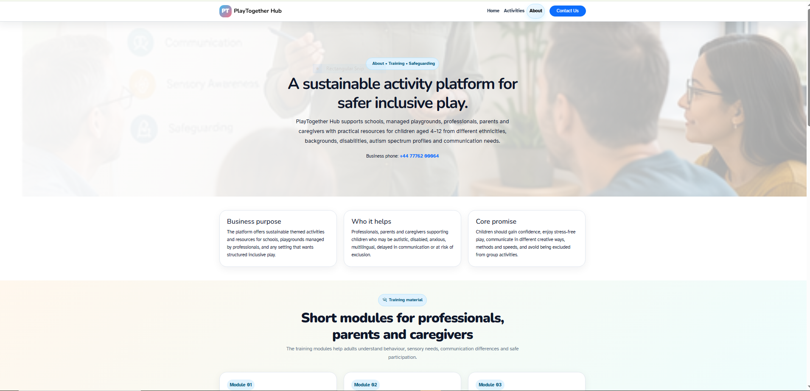
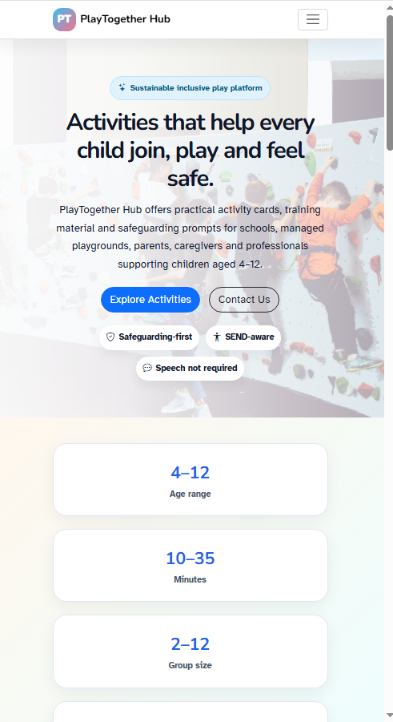
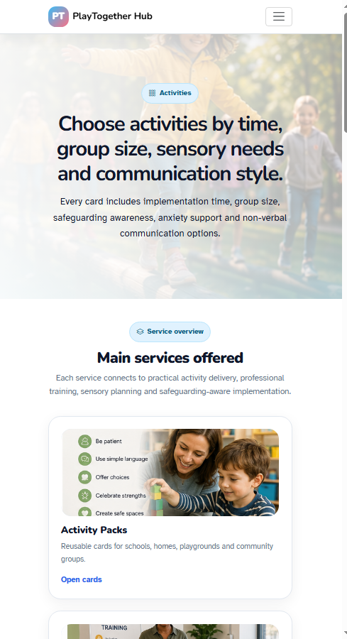
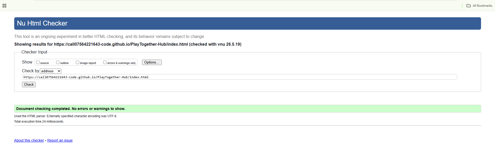
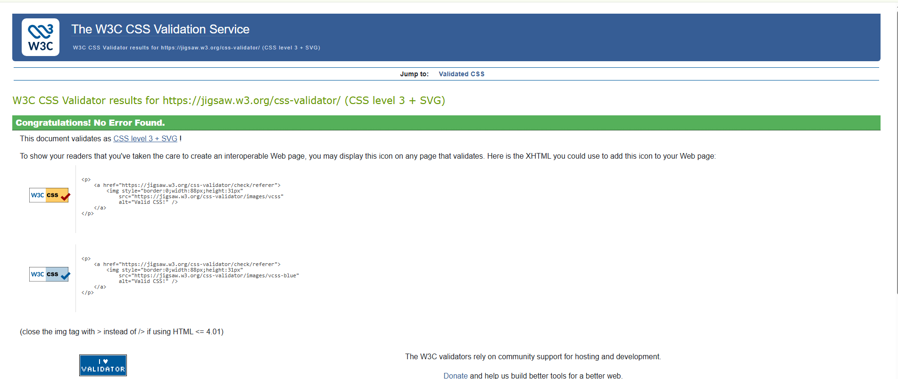
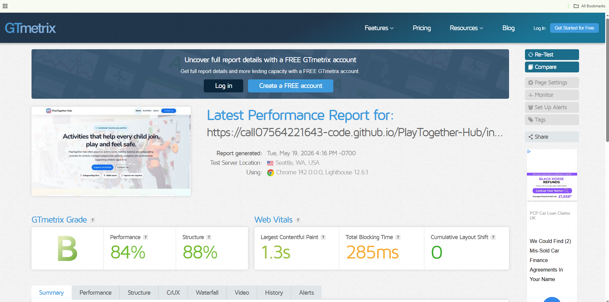
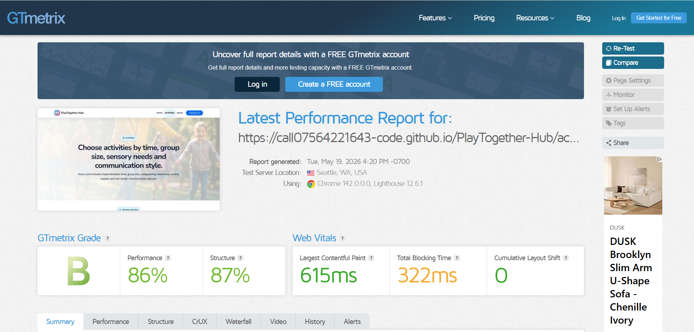
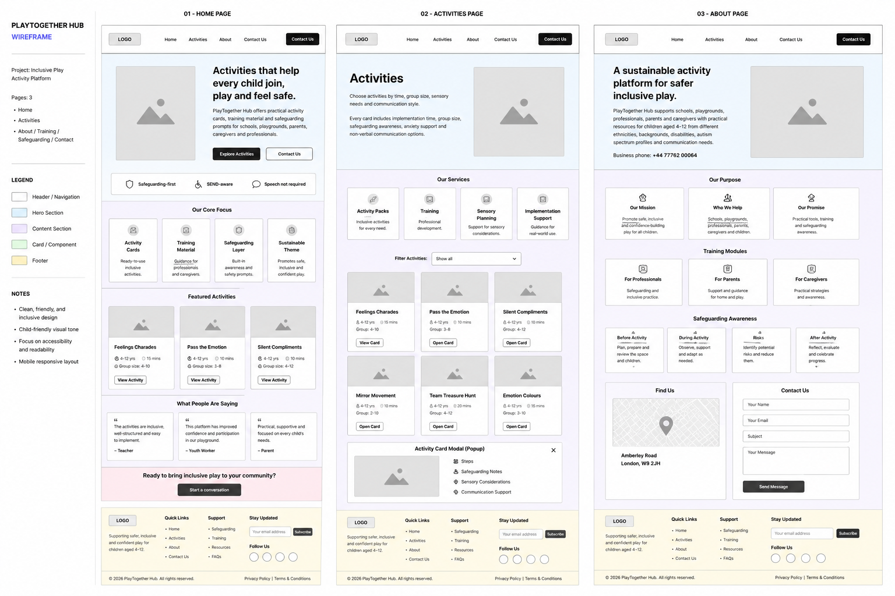

# PlayTogether Hub

## Live Website

https://call07564221643-code.github.io/PlayTogether-Hub/

---

# Table of Contents

1. Project Purpose
2. User Experience (UX)
3. Features
4. Technologies Used
5. Responsive Design
6. Accessibility
7. JavaScript Features
8. Desktop Screenshots
9. Mobile Screenshots
10. Validation Screenshots
11. Lighthouse Performance Tests
12. Wireframes
13. Testing & Validation
14. Deployment Procedure
15. GitHub Version Control
16. Bugs & Fixes
17. AI Usage Declaration
18. Credits & Attributions
19. Future Improvements

---

# Project Purpose

PlayTogether Hub is a responsive front-end educational SaaS-style platform designed to support inclusive play activities for children aged 4–12.

The platform supports:

- Schools
- Managed playgrounds
- Parents
- Caregivers
- SEND professionals
- Youth workers

The project demonstrates responsive front-end development using:

- HTML5
- CSS3
- Bootstrap 5.3
- JavaScript

---

# User Experience (UX)

The website was designed using modern UX/UI principles to ensure:

- Clear navigation
- Responsive layouts
- Easy-to-read sections
- Logical structure
- Accessibility support
- User-friendly interactions
- Interactive feedback systems

The navigation menu highlights the active page so users always know their current page location.

---

# Features

## Responsive Navigation

- Sticky Bootstrap navbar
- Mobile hamburger menu
- Active page highlighting
- Responsive layout

## Hero Background System

- Full-width responsive hero sections
- Readability overlay system
- SaaS-style modern layout

## Activity Cards

- JavaScript-generated cards
- Reusable card structure
- Dynamic DOM rendering
- Responsive Bootstrap grid

## Popup Modal System

- Bootstrap modal integration
- Interactive “Open Card” buttons
- Dynamic JavaScript content

## Contact Form

- Bootstrap validation
- JavaScript success feedback
- Accessible labels and structure

## Newsletter Signup

- Front-end signup interaction
- User feedback system

## Safeguarding Section

Includes guidance for:

- Before activities
- During activities
- Adult awareness
- After activities

---

# Technologies Used

## Languages

- HTML5
- CSS3
- JavaScript (ES6)

## Frameworks & Libraries

- Bootstrap 5.3
- Bootstrap Icons
- Google Fonts

## Development Tools

- Visual Studio Code
- Git
- GitHub
- GitHub Pages

---

# Responsive Design

The website was designed mobile-first and tested across:

- Mobile devices
- Tablets
- Desktop screens
- Large displays

Bootstrap responsive grid classes used include:

```html
container
row
col-md-6
col-lg-4
g-4
```

---

# Accessibility

Accessibility improvements include:

- Semantic HTML structure
- Skip-to-content link
- Alt text for images
- Keyboard-focus styling
- Accessible forms
- ARIA labels
- Reduced motion support
- Appropriate colour contrast

Fonts used:

- Nunito
- Atkinson Hyperlegible

---

# JavaScript Features

JavaScript is used to create:

- Dynamic activity cards
- Popup modal system
- Contact form feedback
- Newsletter interactions
- Activity filtering
- Interactive user actions

---

# Desktop Screenshots

## Home Page — Desktop View



---

## Activities Page — Desktop View

---

## About Page — Desktop View



# Mobile Screenshots

## Home Page — Mobile View




## Activities Page — Mobile View

INSERT IMAGE HERE



---

## About Page — Mobile View

INSERT IMAGE HERE


---

# Validation Screenshots

## W3C HTML Validation



---

## W3C CSS Validation




---

# Lighthouse Performance Tests

## Home Page Lighthouse Test




---

## Activities Page Lighthouse Test




---

# Wireframes


## Home,Activities, and about Pages Wireframe




# Testing & Validation

## HTML Validation

- W3C HTML validation completed

## CSS Validation

- W3C CSS validation completed

## Lighthouse Testing

Lighthouse was replaced with GTmetrix page speed testing to review:

- Performance
- Accessibility
- Best Practices
- SEO

---

# Deployment Procedure

The project was deployed using GitHub Pages.

## Deployment Steps

1. Create GitHub repository
2. Upload project files
3. Push files using Git
4. Open repository settings
5. Open Pages section
6. Select main branch
7. Save deployment settings

Live website:

https://call07564221643-code.github.io/PlayTogether-Hub/

---

# GitHub Version Control

Git and GitHub were used throughout development.

Example commands used:

```bash
git add .
git commit -m "Updated navbar styling"
git push origin main
```

Clear commit history was maintained during development.

---

# Bugs & Fixes

## Navbar Active State

Issue:
Active page was difficult to identify.

Fix:
Added responsive active-page styling and hover effects.

---

## About Page Card Alignment

Issue:
Safeguarding and information cards were misaligned.

Fix:
Added Bootstrap flex alignment and equal-height card structure.

---

## Git Merge Conflicts

Issue:
Push rejected because remote branch contained newer commits.

Fix:
Resolved merge conflicts and completed Git merge successfully.

---

# AI Usage Declaration

AI tools were used during this educational project for:

- Code explanations
- Debugging support
- UX/UI suggestions
- README drafting
- Accessibility improvements
- Bootstrap optimisation
- Git/GitHub troubleshooting

All final implementation decisions were reviewed and applied manually by Student H.A, ID number 516422.

---

# Credits & Attributions

## Libraries & Frameworks

- Bootstrap 5.3
- Bootstrap Icons
- Google Fonts

## Fonts

- Nunito
- Atkinson Hyperlegible

## Hosting

- GitHub Pages

---

# Future Improvements

Planned future updates include:

- Dark mode
- Backend integration
- User accounts
- Search functionality
- Database support
- Activity bookmarking
- Admin dashboard
- Accessibility improvements
- Multi-language support

---

# Author

PlayTogether Hub  
Educational Front-End SaaS Project  
2026